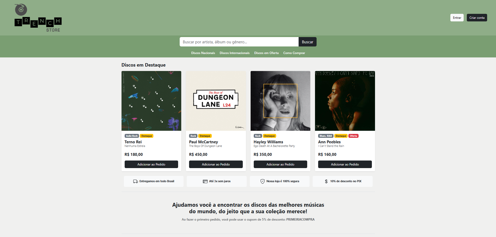
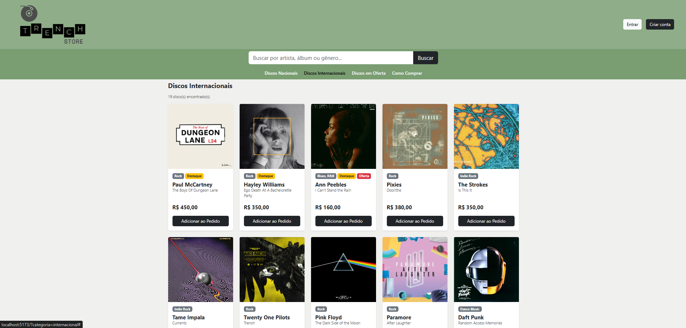
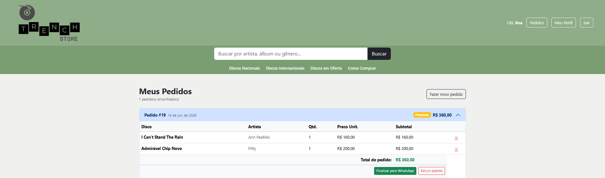
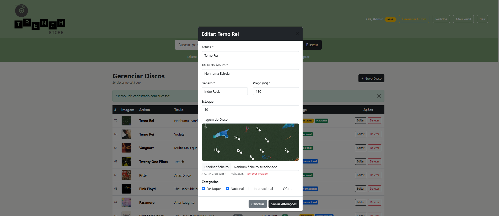
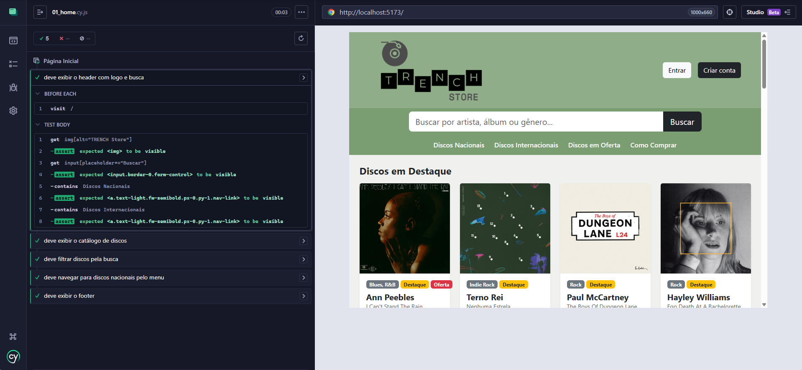
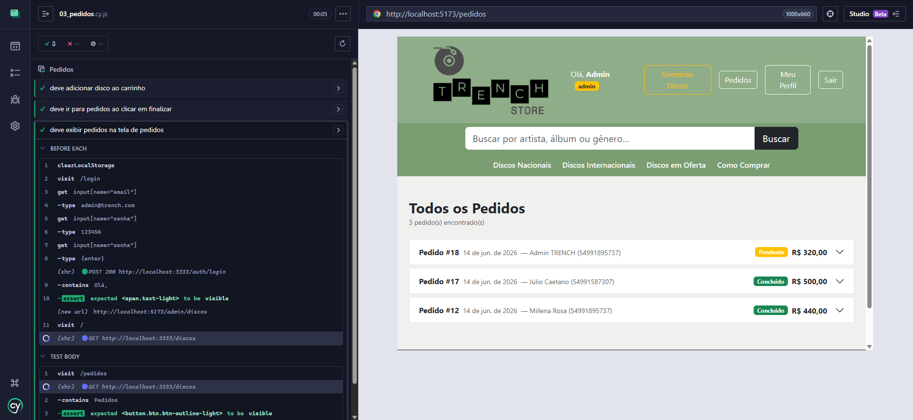

# TRENCH Store — E-commerce de Discos de Vinil

> Trabalho de Tópicos em Desenvolvimento de Software II

Aplicação fullstack completa para um e-commerce de discos de vinil, com API RESTful, autenticação JWT, CRUD completo e testes automatizados.

---

## Sobre o Projeto

A **TRENCH Store** é uma aplicação de e-commerce desenvolvida para venda de discos de vinil. O sistema permite que clientes naveguem pelo catálogo, façam pedidos e entrem em contato com a loja via WhatsApp. Administradores podem gerenciar o catálogo completo de discos e acompanhar todos os pedidos.






---

## Tecnologias

### Back-end

| Tecnologia     | Versão | Uso                      |
| -------------- | ------ | ------------------------ |
| Node.js        | 22.x   | Runtime                  |
| Express        | 4.x    | Framework HTTP           |
| Prisma ORM     | 6.x    | Acesso ao banco de dados |
| SQLite         | —      | Banco de dados           |
| JSON Web Token | —      | Autenticação             |
| bcryptjs       | —      | Hash de senhas           |
| Jest           | —      | Testes unitários         |
| Supertest      | —      | Testes de integração     |

### Front-end

| Tecnologia       | Versão | Uso                  |
| ---------------- | ------ | -------------------- |
| React            | 18.x   | Interface do usuário |
| Vite             | 5.x    | Bundler              |
| React Bootstrap  | —      | Componentes de UI    |
| Axios            | —      | Consumo da API       |
| React Router DOM | —      | Navegação SPA        |
| Cypress          | 15.x   | Testes E2E           |

---

## Funcionalidades

### Clientes

- ✅ Cadastro com nome, e-mail, telefone e senha
- ✅ Login com autenticação JWT
- ✅ Navegação pelo catálogo de discos
- ✅ Filtro por categoria: Nacional, Internacional, Ofertas
- ✅ Busca por artista, álbum ou gênero
- ✅ Adicionar discos ao pedido
- ✅ Finalizar pedido via WhatsApp
- ✅ Visualizar histórico de pedidos
- ✅ Editar perfil (nome e telefone)

### Administradores

- ✅ CRUD completo de discos (criar, editar, deletar)
- ✅ Upload de imagem dos discos
- ✅ Marcar discos como Destaque, Nacional, Internacional e/ou Oferta
- ✅ Visualizar todos os pedidos de todos os clientes
- ✅ Fluxo de status dos pedidos: Pendente → Em Processamento → Concluído
- ✅ Entrar em contato com cliente via WhatsApp diretamente do painel

---

## Pré-requisitos

- [Node.js](https://nodejs.org/) v18 ou superior
- npm v8 ou superior

---

## Instalação e Execução

### 1. Clone o repositório

```bash
git clone https://github.com/millenarrosa/trenchstore.git
cd trenchstore
```

### 2. Configure e inicie o Back-end

```bash
cd trench-records-api

# Instale as dependências
npm install

# Crie o arquivo .env
echo DATABASE_URL="file:./dev.db" > .env
echo JWT_SECRET="trench_records_super_secreto_2024" >> .env

# Rode as migrations
npx prisma migrate deploy

# Gere o Prisma Client
npx prisma generate

# Inicie o servidor
npx nodemon src/server.js
```

> API disponível em: `http://localhost:3333`

### 3. Configure e inicie o Front-end

```bash
# Em outro terminal
cd trench-records-web

# Instale as dependências
npm install

# Inicie o servidor
npm run dev
```

> Front-end disponível em: `http://localhost:5173`

### 4. Crie o usuário administrador

Com a API rodando, faça uma requisição POST:

```bash
curl -X POST http://localhost:3333/auth/signup \
  -H "Content-Type: application/json" \
  -d '{"nome":"Admin","email":"admin@trench.com","senha":"123456","telefone":"54991895737","role":"admin"}'
```

---

## Rotas da API

### Autenticação

| Método | Rota           | Descrição                | Auth |
| ------ | -------------- | ------------------------ | ---- |
| POST   | `/auth/signup` | Cadastro de usuário      | ❌   |
| POST   | `/auth/login`  | Login e geração de token | ❌   |

### Discos

| Método | Rota          | Descrição              | Auth     |
| ------ | ------------- | ---------------------- | -------- |
| GET    | `/discos`     | Listar todos os discos | ❌       |
| GET    | `/discos/:id` | Buscar disco por ID    | ❌       |
| POST   | `/discos`     | Criar disco            | ✅ Admin |
| PUT    | `/discos/:id` | Atualizar disco        | ✅ Admin |
| DELETE | `/discos/:id` | Deletar disco          | ✅ Admin |

### Pedidos

| Método | Rota                  | Descrição               | Auth     |
| ------ | --------------------- | ----------------------- | -------- |
| POST   | `/pedidos`            | Criar pedido            | ✅       |
| GET    | `/pedidos`            | Listar pedidos          | ✅       |
| GET    | `/pedidos/:id`        | Buscar pedido           | ✅       |
| GET    | `/pedidos/:id/discos` | Listar discos do pedido | ✅       |
| PATCH  | `/pedidos/:id/status` | Atualizar status        | ✅ Admin |
| DELETE | `/pedidos/:id`        | Deletar pedido          | ✅       |

### Usuários

| Método | Rota            | Descrição        | Auth |
| ------ | --------------- | ---------------- | ---- |
| PUT    | `/usuarios/:id` | Atualizar perfil | ✅   |

---

## Testes

### Back-end (Jest + Supertest)

```bash
cd trench-records-api
npm test
```

**Suítes de teste:**

- `auth.test.js` — Cadastro e login de usuários
- `discos.test.js` — CRUD de discos e controle de acesso
- `pedidos.test.js` — Criação de pedidos e rota `/pedidos/:id/discos`

**Resultado esperado:** 24 testes passando ✅

### Front-end (Cypress E2E)

```bash
cd trench-records-web

# Interface gráfica
npx cypress open

# Modo headless
npx cypress run
```

**Suítes de teste:**

- `01_home.cy.js` — Página inicial e catálogo
- `02_auth.cy.js` — Login, logout e rotas protegidas
- `03_pedidos.cy.js` — Fluxo de pedidos
- `04_admin.cy.js` — Painel administrativo




---

## Autora

Desenvolvido por **Millena Rosa**.

---

## Licença

Este projeto foi desenvolvido para fins acadêmicos.
